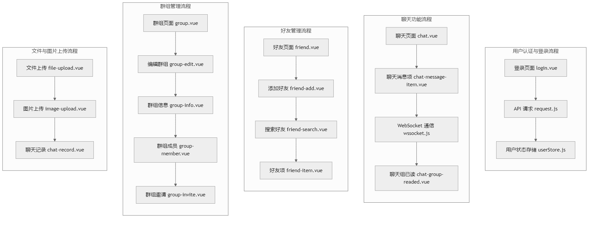

项目主要包括以下几个模块：

- ### 登录模块 (LoginModule)

- 用户登录：用户通过输入用户凭证（如用户名和密码）进行登录。
- 验证用户凭证：登录模块验证用户提供的凭证是否正确。
- 创建会话：验证成功后，登录模块为用户创建一个会话。


- ### 聊天模块 (ChatModule)

- 发送消息：用户通过聊天模块发送消息。
- 格式化消息：聊天模块对用户输入的消息进行格式化处理。
- 发送消息到服务器：格式化后的消息被发送到服务器。
- 接收消息确认：服务器确认消息已接收，并返回确认信息。


- ### 好友模块 (FriendModule)

- 添加好友：用户可以通过好友模块添加新朋友。
- 搜索用户：好友模块提供用户搜索功能。
- 发送好友请求：用户可以向其他用户发送好友请求。
- 接受好友请求：用户可以接受其他用户的好友请求。
- 更新好友列表：好友模块会更新用户的好友列表。


- ### 群组模块 (GroupModule)

- 创建群组：用户可以创建新的群组。
- 添加/移除成员：群组模块允许用户添加或移除群组成员。
- 编辑群组详情：用户可以编辑群组的详细信息，如群名称、公告等。
- 列出群组会话：群组模块可以列出用户参与的所有群组会话。


- ### 文件上传模块 (FileUploadModule)

- 上传文件/图片：用户可以通过文件上传模块上传文件或图片。
- 选择文件：用户选择要上传的文件。
- 上传到服务器：文件上传模块将文件上传到服务器。
- 显示上传内容：上传完成后，文件上传模块会显示上传的文件内容。


- ### 项目流程图 (ProjectFlowchart)



- ### 国际化模块 (I18nModule)

- 多语言支持：项目支持中文和英文等多种语言切换。
- 语言文件位置：
  - 入口文件：`i18n/index.js` - 负责语言配置的初始化和语言切换逻辑
  - 语言包文件：`i18n/locales/` 目录下包含各语言的翻译文件
    - zh-CN.js: 简体中文
    - en.js: 英文
- i18n版本：
  - vue-i18n: 9.1.9 Dclond官方指定这个版本，不要升级。
- 使用方法：
  - 在组件中通过 $t('key') 方法访问翻译文本
  - 使用 language-switcher 组件进行语言切换
  - 支持模板字符串形式的动态翻译

- ### 项目运行说明 (Setup Guide)

#### 环境要求
- Node.js >= 14.0.0
- HBuilderX IDE
- uni-app 开发环境

#### 安装步骤
1. 克隆项目
```bash
git clone [项目地址]
cd uni-im
```

2. 安装依赖
```bash
npm install
# 或者使用
yarn install
```

#### 运行项目
1. 开发模式
```bash
# HBuilderX
运行 -> 运行到内置浏览器
# 或者命令行
npm run dev:h5
```

2. 发布构建
```bash
# H5平台
npm run build:h5

# 微信小程序
npm run build:mp-weixin

# APP平台
通过HBuilderX发布App
```

#### 开发说明
- 项目基于 uni-app 框架开发
- 支持多端运行（H5、App、小程序等）
- 使用 Vuex 进行状态管理
- 采用模块化开发方式

#### 注意事项
- 首次运行需要在 manifest.json 中配置应用标识等信息
- 跨域问题处理参考 vite.config.js 的配置
- 建议使用 HBuilderX 进行开发调试
- 注意保持Node.js版本兼容性

#### 线路配置
- BASE_URL
- https://api.gemeney-st.xyz/imapi
- WSS
- wss://api.gemeney-st.xyz/ws